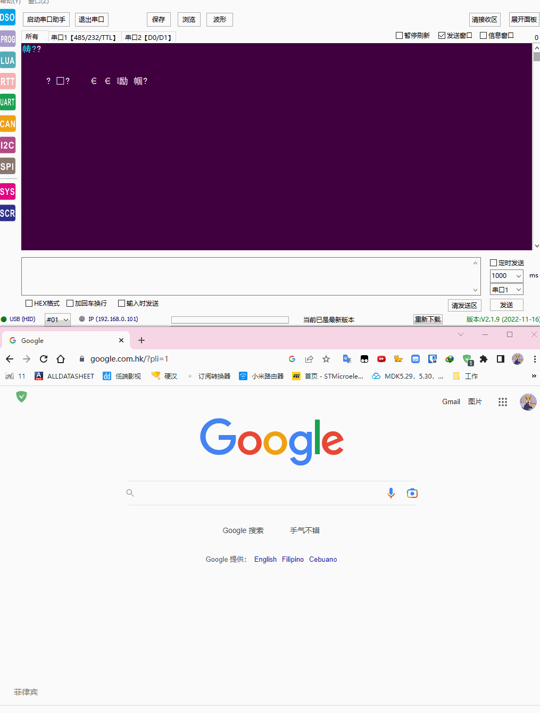

# WEBUSB
通过网页端进行dfu固件升级

# 硬件

- stm32f103zet6

- [测试网址](https://devanlai.github.io/webdfu/dfu-util/)

## 下载固件

1. 上电前按住按键进入 dfu 模式
2. 连接设备
3. 填入app偏移地址 （0x08010000）
4. 选择并下载app固件
5. 复位
6. app运行开始打印

# 上传固件

1. 上电前按住按键进入 dfu 模式
2. 连接设备
3. 填入上传固件偏移地址 （0x08010000）
4. 填入上传固件大小
5. 点击上传

# 关联项目

[webusb](https://github.com/WICG/webusb)

[webdfu](https://github.com/devanlai/webdfu)

[dapboot](https://github.com/devanlai/dapboot)
